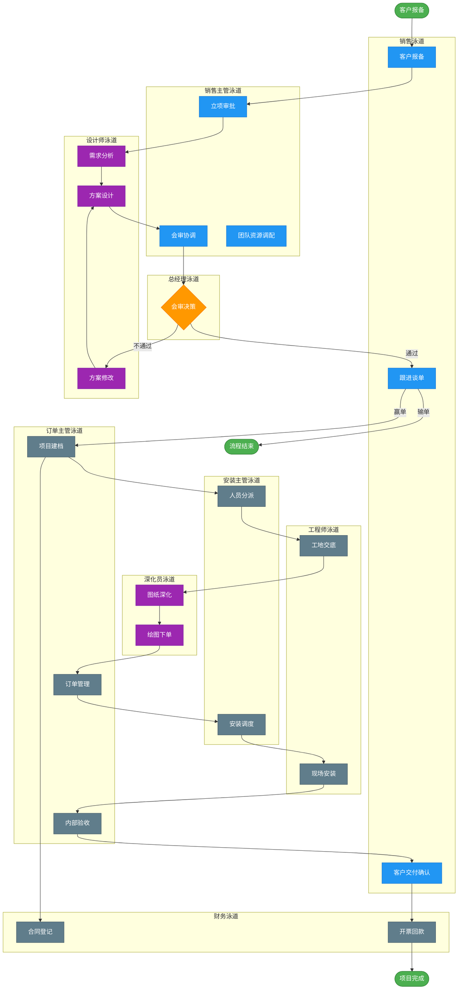
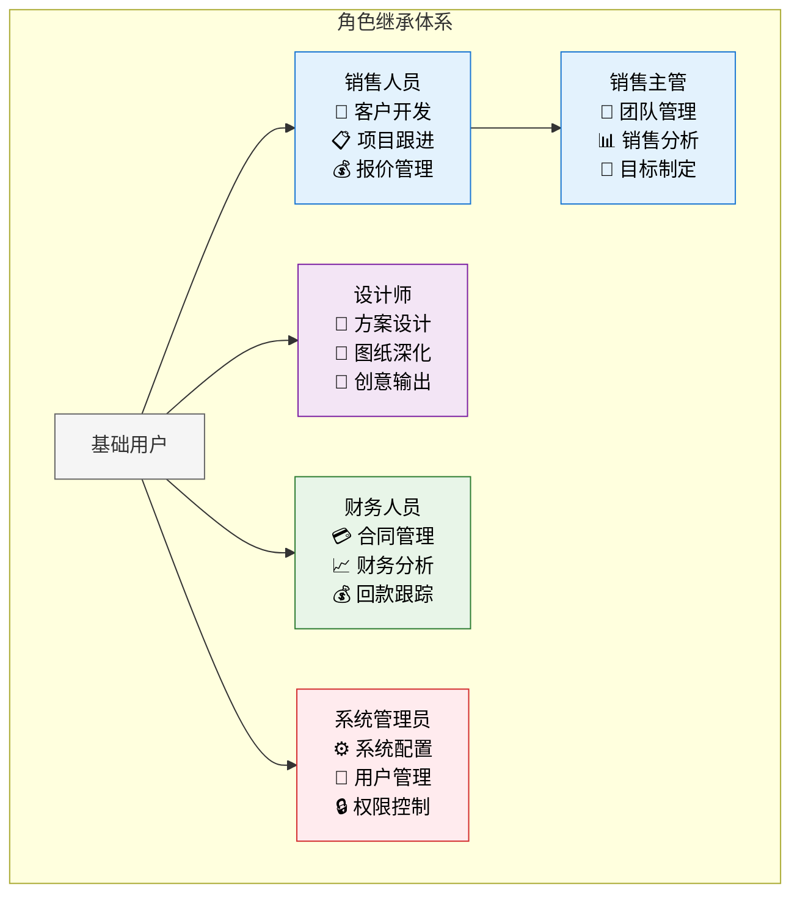
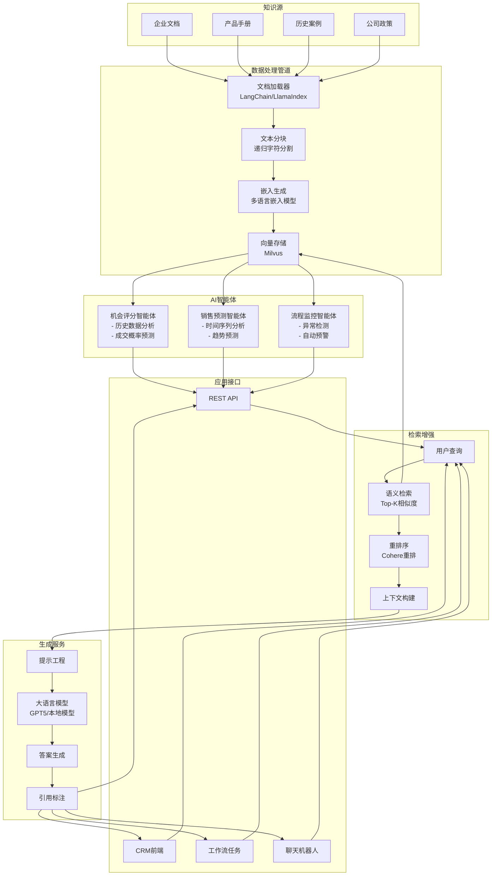
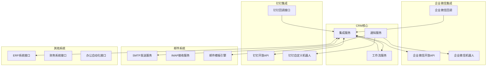
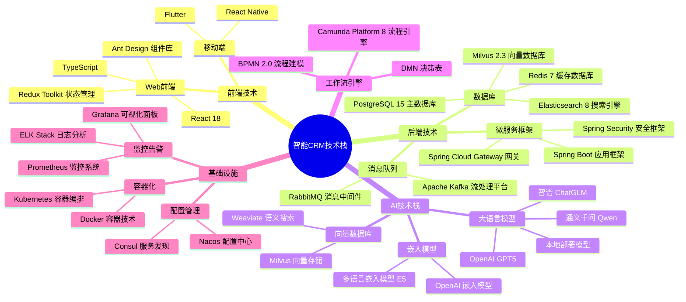
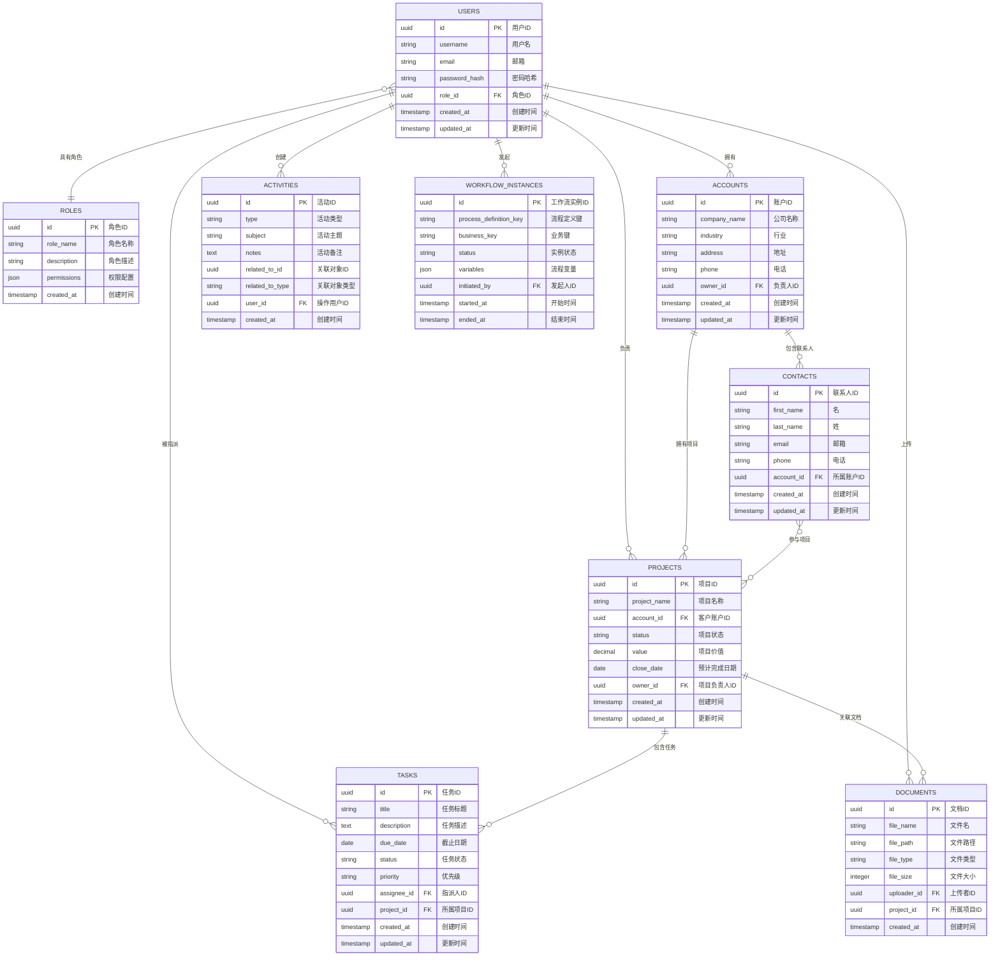

# 智能CRM系统架构方案（简化版）

## 📋 文档导航

- [系统概述](#系统概述)
- [完整架构图表](#完整架构图表)
- [核心架构设计](#核心架构设计)
- [业务流程自动化](#业务流程自动化)
- [AI智能层](#ai智能层)
- [实施计划](#实施计划)

---

## 🎯 系统概述

本CRM系统旨在打造一个智能化的企业"中枢神经系统"，实现：
- **数据统一**：消除信息孤岛，建立统一的客户数据平台
- **流程自动化**：将复杂业务流程数字化，提升运营效率
- **智能决策**：嵌入AI能力，提供数据驱动的业务洞察

**核心价值**：
- 提升销售效率30-50%
- 降低运营成本20-30%
- 增强客户满意度和竞争优势

---

## 📊 完整架构图表

### 1. 整体系统架构

```mermaid
graph TB
    %% 用户层
    subgraph "用户界面层"
        WEB[Web前端<br/>React/Vue]
        MOBILE[移动端App<br/>React Native/Flutter]
        API_DOCS[API文档<br/>Swagger/OpenAPI]
    end

    %% API网关
    GATEWAY[API网关<br/>Kong/Nginx<br/>- 请求路由<br/>- 身份验证<br/>- 速率限制<br/>- 负载均衡]

    %% 核心微服务层
    subgraph "核心微服务层"
        AUTH[用户认证服务<br/>- 用户管理<br/>- RBAC权限<br/>- OAuth 2.0<br/>- JWT令牌]
        
        CUSTOMER[客户账户服务<br/>- 客户信息<br/>- 公司档案<br/>- 联系人管理<br/>- 客户画像]
        
        PROJECT[项目机会服务<br/>- 售前流程<br/>- 售后项目<br/>- 商机管理<br/>- 销售漏斗]
        
        TASK[任务管理服务<br/>- 任务分配<br/>- 看板视图<br/>- 进度跟踪<br/>- 协作工具]
        
        WORKFLOW[工作流服务<br/>- Camunda BPM<br/>- 流程自动化<br/>- Saga编排<br/>- 业务规则]
        
        AI_SERVICE[AI智能服务<br/>- RAG问答<br/>- 智能体<br/>- 预测分析<br/>- NLP处理]
        
        INTEGRATION[集成服务<br/>- 第三方API<br/>- Webhook处理<br/>- 数据同步<br/>- 消息转换]
        
        NOTIFICATION[通知服务<br/>- 应用内消息<br/>- 邮件推送<br/>- 移动通知<br/>- 实时通信]
    end

    %% 数据存储层
    subgraph "数据存储层"
        POSTGRES[(PostgreSQL<br/>主数据库<br/>- 事务数据<br/>- 用户权限<br/>- 业务实体)]
        
        REDIS[(Redis<br/>缓存层<br/>- 会话存储<br/>- 热点数据<br/>- 分布式锁)]
        
        VECTOR_DB[(向量数据库<br/>Milvus/Weaviate<br/>- 文档嵌入<br/>- 语义搜索)]
        
        FILES[文件存储<br/>MinIO/AWS S3<br/>- 文档管理<br/>- 图片视频<br/>- 备份归档]
        
        ELASTIC[Elasticsearch<br/>- 全文搜索<br/>- 日志分析<br/>- 业务指标]
    end

    %% 外部系统集成
    subgraph "外部系统集成"
        WECHAT[企业微信<br/>- 客服对话<br/>- 群组通知<br/>- 审批流程]
        
        DINGTALK[钉钉<br/>- 任务同步<br/>- 日程管理<br/>- 视频会议]
        
        EMAIL[邮件系统<br/>- SMTP/IMAP<br/>- 邮件营销<br/>- 自动回复]
        
        AI_API[AI模型API<br/>- OpenAI GPT<br/>- 本地大模型<br/>- 专业AI服务]
        
        ERP[ERP系统<br/>- 财务对接<br/>- 库存管理<br/>- 订单同步]
    end

    %% 基础设施层
    subgraph "基础设施层"
        MQ[消息队列<br/>RabbitMQ/Kafka<br/>- 异步处理<br/>- 事件驱动<br/>- 解耦通信]
        
        MONITOR[监控告警<br/>Prometheus/Grafana<br/>- 性能监控<br/>- 业务指标<br/>- 异常告警]
        
        LOG[日志系统<br/>ELK Stack<br/>- 集中日志<br/>- 链路追踪<br/>- 审计记录]
        
        CONFIG[配置中心<br/>Consul/Nacos<br/>- 动态配置<br/>- 服务发现<br/>- 健康检查]
    end

    %% 连接关系
    WEB --> GATEWAY
    MOBILE --> GATEWAY
    
    GATEWAY --> AUTH
    GATEWAY --> CUSTOMER
    GATEWAY --> PROJECT
    GATEWAY --> TASK
    GATEWAY --> WORKFLOW
    GATEWAY --> AI_SERVICE
    GATEWAY --> INTEGRATION
    GATEWAY --> NOTIFICATION

    %% 服务间通信
    AUTH -.-> MQ
    CUSTOMER -.-> MQ
    PROJECT -.-> MQ
    TASK -.-> MQ
    WORKFLOW -.-> MQ
    AI_SERVICE -.-> MQ
    INTEGRATION -.-> MQ
    NOTIFICATION -.-> MQ

    %% 数据库连接
    AUTH --> POSTGRES
    CUSTOMER --> POSTGRES
    PROJECT --> POSTGRES
    TASK --> POSTGRES
    WORKFLOW --> POSTGRES
    
    AI_SERVICE --> VECTOR_DB
    AI_SERVICE --> REDIS
    AI_SERVICE --> ELASTIC
    
    PROJECT --> FILES
    CUSTOMER --> FILES
    
    %% 缓存连接
    AUTH --> REDIS
    CUSTOMER --> REDIS
    PROJECT --> REDIS

    %% 外部集成
    INTEGRATION --> WECHAT
    INTEGRATION --> DINGTALK
    INTEGRATION --> EMAIL
    INTEGRATION --> ERP
    AI_SERVICE --> AI_API

    %% 基础设施连接
    GATEWAY --> CONFIG
    AUTH --> CONFIG
    CUSTOMER --> CONFIG
    PROJECT --> CONFIG
    TASK --> CONFIG
    WORKFLOW --> CONFIG
    AI_SERVICE --> CONFIG
    INTEGRATION --> CONFIG
    NOTIFICATION --> CONFIG

    %% 监控连接
    GATEWAY -.-> MONITOR
    AUTH -.-> MONITOR
    CUSTOMER -.-> MONITOR
    PROJECT -.-> MONITOR
    TASK -.-> MONITOR
    WORKFLOW -.-> MONITOR
    AI_SERVICE -.-> MONITOR
    INTEGRATION -.-> MONITOR
    NOTIFICATION -.-> MONITOR

    %% 日志连接
    GATEWAY -.-> LOG
    AUTH -.-> LOG
    CUSTOMER -.-> LOG
    PROJECT -.-> LOG
    TASK -.-> LOG
    WORKFLOW -.-> LOG
    AI_SERVICE -.-> LOG
    INTEGRATION -.-> LOG
    NOTIFICATION -.-> LOG

    %% 样式定义
    classDef userLayer fill:#e1f5fe,stroke:#01579b,color:#000
    classDef serviceLayer fill:#f3e5f5,stroke:#4a148c,color:#000
    classDef dataLayer fill:#e8f5e8,stroke:#1b5e20,color:#000
    classDef externalLayer fill:#fff3e0,stroke:#e65100,color:#000
    classDef infraLayer fill:#fce4ec,stroke:#880e4f,color:#000

    class WEB,MOBILE,API_DOCS userLayer
    class AUTH,CUSTOMER,PROJECT,TASK,WORKFLOW,AI_SERVICE,INTEGRATION,NOTIFICATION serviceLayer
    class POSTGRES,REDIS,VECTOR_DB,FILES,ELASTIC dataLayer
    class WECHAT,DINGTALK,EMAIL,AI_API,ERP externalLayer
    class MQ,MONITOR,LOG,CONFIG infraLayer
```

**架构特点**：
- **微服务设计**：8个核心服务，独立开发部署
- **分层架构**：用户层、服务层、数据层、基础设施层清晰分离
- **高可用性**：负载均衡、缓存、监控告警完整覆盖
- **扩展性强**：支持水平扩展和新功能模块接入

### 2. BPMN业务流程图

**流程特点**：
- **售前流程**：客户报备 → 立项审批 → 需求分析 → 方案设计 → 会审决策 → 跟进谈单
- **售后流程**：项目建档 → 合同登记 → 人员分派 → 工地交底 → 图纸深化 → 绘图下单 → 订单管理 → 安装调度 → 现场安装 → 内部验收 → 客户交付确认 → 开票回款
- **角色协同**：9个业务角色，职责明确，流程规范
- **决策节点**：总经理会审是关键决策点，确保项目质量

### 3. RBAC权限控制体系

#### 角色继承关系

#### 权限矩阵表

| 功能模块 | 销售 | 销售主管 | 设计师 | 财务 | 系统管理员 |
|----------|------|----------|--------|------|------------|
| **客户管理** | ✅ 完全权限 | ✅ 完全权限 | 👁️ 只读 | 👁️ 只读 | ✅ 完全权限 |
| **项目管理** | ✅ 负责项目 | ✅ 团队项目 | ✏️ 设计相关 | 👁️ 财务信息 | ✅ 完全权限 |
| **报价管理** | ✅ 创建编辑 | ✅ 审批管理 | 👁️ 只读 | ✏️ 价格审核 | ✅ 完全权限 |
| **文件管理** | ✏️ 基础操作 | ✅ 完全权限 | ✅ 设计文件 | 👁️ 查看下载 | ✅ 完全权限 |
| **报表分析** | 👁️ 基础报表 | ✅ 高级报表 | ❌ 无权限 | ✅ 财务报表 | ✅ 完全权限 |

**权限说明**：
- ✅ 完全权限：增删改查全部操作
- ✏️ 编辑权限：查看和修改，不能删除
- 👁️ 只读权限：仅查看，不能修改
- ❌ 无权限：完全无法访问

### 4. RAG智能层架构

**AI能力**：
- **知识问答**：基于企业知识库的智能问答
- **智能评分**：客户机会自动评分和排序
- **销售预测**：基于历史数据的销售趋势预测
- **流程监控**：异常检测和自动预警提醒

### 5. 第三方集成架构

**集成特点**：
- **企业微信**：客服对话、群组通知、审批流程
- **钉钉平台**：任务同步、日程管理、视频会议
- **邮件系统**：营销邮件、自动回复、模板化通知
- **ERP对接**：财务数据、库存信息、订单同步

---

## 🏗️ 核心架构设计

### 微服务架构优势

**为什么选择微服务**：
- **独立部署**：每个服务可以独立开发、测试、部署
- **技术多样性**：不同服务可以选择最适合的技术栈
- **故障隔离**：单个服务故障不会影响整个系统
- **团队协作**：不同团队可以并行开发不同服务

### 核心服务说明

| 服务名称 | 主要职责 | 技术栈 |
|----------|----------|--------|
| **用户认证服务** | 用户管理、权限控制、JWT认证 | Spring Security + JWT |
| **客户账户服务** | 客户信息、公司档案、联系人管理 | Spring Boot + PostgreSQL |
| **项目机会服务** | 售前流程、售后项目、销售漏斗 | Spring Boot + Redis |
| **任务管理服务** | 任务分配、看板视图、进度跟踪 | Spring Boot + WebSocket |
| **工作流服务** | 流程自动化、业务规则引擎 | Camunda + Spring Boot |
| **AI智能服务** | RAG问答、智能体、预测分析 | Python + FastAPI |
| **集成服务** | 第三方API、数据同步 | Spring Boot + MQ |
| **通知服务** | 消息推送、邮件通知 | Spring Boot + RabbitMQ |

### 数据存储策略

**数据库选型**：
- **PostgreSQL**：主数据库，存储业务核心数据
- **Redis**：缓存层，提升查询性能
- **Milvus**：向量数据库，支持AI语义搜索
- **Elasticsearch**：全文搜索，日志分析
- **MinIO**：文件存储，支持大文件管理

---

## ⚙️ 业务流程自动化

### 工作流引擎

**Camunda平台**：
- **BPMN 2.0**：标准化的流程建模语言
- **可视化设计**：拖拽式流程设计器
- **规则引擎**：支持复杂的业务规则
- **监控分析**：实时流程监控和性能分析

### 自动化场景

**售前自动化**：
- 客户报备后自动分配销售人员
- 立项审批流程自动流转
- 方案设计完成后自动通知相关人员
- 总经理决策结果自动同步给团队

**售后自动化**：
- 项目启动后自动创建任务清单
- 安装进度自动更新项目状态
- 验收完成后自动触发开票流程
- 回款到账后自动更新财务记录

### 智能决策

**AI辅助决策**：
- **客户评分**：基于历史数据自动评估客户价值
- **风险预警**：项目延期风险提前预警
- **资源优化**：智能推荐最佳人员配置
- **销售预测**：基于趋势分析预测销售业绩

---

## 🤖 AI智能层

### RAG知识库

**知识管理**：
- **文档处理**：自动解析企业文档、产品手册
- **知识抽取**：提取关键信息，建立知识图谱
- **语义搜索**：支持自然语言查询
- **持续学习**：根据用户反馈优化知识库

### 智能体系统

**三大智能体**：

1. **机会评分智能体**
   - 分析客户历史行为
   - 评估成交概率
   - 推荐最佳跟进策略

2. **销售预测智能体**
   - 时间序列分析
   - 趋势预测建模
   - 业绩目标达成预警

3. **流程监控智能体**
   - 异常检测算法
   - 自动预警机制
   - 优化建议推荐

### AI技术栈

**模型选择**：
- **大语言模型**：OpenAI GPT5 + 本地化模型
- **嵌入模型**：多语言嵌入模型E5
- **向量数据库**：Milvus 2.3
- **机器学习**：scikit-learn + TensorFlow

---

## 📅 实施计划

### 分阶段实施路线图

```mermaid
gantt
    title CRM System Implementation Roadmap
    dateFormat X
    axisFormat %w

    section Phase 1 Core Foundation
    System Architecture    :arch, 0, 1w
    API Gateway           :gateway, after arch, 5d
    User Authentication   :auth, after gateway, 2w
    Customer Service      :customer, after auth, 2w
    PostgreSQL Database   :db, after customer, 5d
    Basic RBAC           :rbac, after db, 1w

    section Phase 2 Collaboration
    Project Service       :project, after rbac, 3w
    Task Management      :task, after project, 2w
    Dashboard           :dashboard, after task, 3w
    Kanban View         :kanban, after dashboard, 1w

    section Phase 3 Automation
    Camunda Integration  :workflow, after kanban, 2w
    BPMN Modeling       :bpmn, after workflow, 2w
    Saga Implementation :saga, after bpmn, 3w
    Automation Testing  :auto_test, after saga, 1w

    section Phase 4 AI Intelligence
    AI Service Architecture :ai_arch, after auto_test, 1w
    RAG Knowledge Base     :rag, after ai_arch, 3w
    AI Agents Development  :agents, after rag, 2w
    AI Integration Testing :ai_test, after agents, 2w

    section Phase 5 Ecosystem
    Integration Service    :integration, after ai_test, 2w
    WeChat Integration    :wechat, after integration, 1w
    DingTalk Integration  :dingtalk, after wechat, 1w
    System Deployment     :deploy, after dingtalk, 5d
```

### 实施策略

**阶段目标**：

| 阶段 | 周期 | 核心目标 | 关键产出 |
|------|------|----------|----------|
| **阶段一** | 6-8周 | 搭建系统骨架 | 可运行的基础系统 |
| **阶段二** | 6-8周 | 实现核心业务 | 完整的项目管理功能 |
| **阶段三** | 6-8周 | 流程自动化 | 自动化的业务流程 |
| **阶段四** | 5-7周 | 智能化升级 | AI辅助决策功能 |
| **阶段五** | 3-4周 | 生态集成 | 完整的企业级系统 |

**风险控制**：
- 每个阶段都有可用的功能产出
- 关键技术风险点提前验证
- 用户反馈及时收集和调整
- 性能和安全测试持续进行

### 技术栈选型

**技术选型原则**：
- **成熟稳定**：选择经过市场验证的技术栈
- **生态丰富**：拥有完善的社区和文档支持
- **性能优异**：满足高并发和大数据量处理需求
- **扩展性强**：支持系统的持续演进和功能扩展

### 数据库设计

**数据模型特点**：
- **用户权限**：基于RBAC的权限控制模型
- **客户管理**：公司账户和联系人的层次化管理
- **项目协作**：项目、任务、文档的关联管理
- **活动追踪**：完整的业务操作日志记录
- **工作流支持**：与Camunda流程引擎的数据集成

---

## 📋 总结

### 系统优势

**技术优势**：
- **现代化架构**：微服务 + 容器化 + 云原生
- **AI智能化**：RAG知识库 + 智能体系统
- **高可扩展性**：支持业务快速增长和功能扩展
- **高可用性**：分布式架构 + 故障自愈能力

**业务价值**：
- **效率提升**：自动化流程减少人工操作
- **决策优化**：AI辅助提供数据驱动的洞察
- **协作增强**：统一平台促进团队协作
- **客户满意**：快速响应提升服务质量

### 实施建议

**成功要素**：
- **分阶段实施**：降低风险，确保每阶段都有价值产出
- **用户参与**：充分收集用户需求和反馈
- **技术验证**：关键技术点提前验证和测试
- **团队培训**：确保团队具备相应的技术能力

**预期效果**：
- **6个月内**：完成核心功能，实现基本的CRM管理
- **12个月内**：实现流程自动化，提升运营效率
- **18个月内**：AI功能全面上线，实现智能化管理

这个智能CRM系统将成为企业数字化转型的重要基础设施，为业务增长和竞争优势提供强有力的技术支撑。
