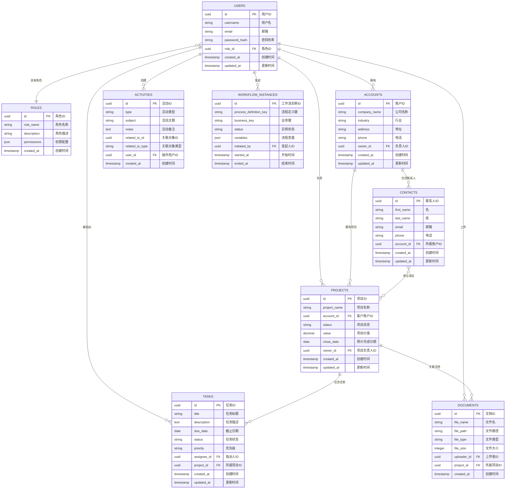

# 智能现代化企业级CRM系统：体系架构与实施方案

## 执行摘要

该系统的愿景不仅是成为一个客户数据仓库，更是要打造一个能够统一数据、自动化复杂业务流程、并嵌入前瞻性人工智能（AI）以驱动战略决策的企业“中枢神经系统”。

方案的核心架构基于三大支柱：微服务架构，为系统提供卓越的敏捷性、可扩展性和技术灵活性；业务流程管理（BPM）引擎，通过流程编排实现用户业务流程的精确数字化和自动化；以及检索增强生成（RAG）技术，构建能够基于企业私有知识进行学习和应答的智能大脑。

这些技术选择将直接转化为显著的商业价值：通过自动化售前售后流程，提升销售速度和项目交付效率；通过AI智能体提供的前瞻性洞察，优化决策质量；通过无缝的第三方集成，提高协同办公效率；最终，通过一个统一、智能的平台，增强客户满意度，构筑持久的竞争优势。本报告将通过分阶段的实施路线图，清晰地展示从基础核心（MVP）到全功能智能平台的演进路径，确保项目的稳健推进与价值的持续交付。

## 完整系统架构图

### 1. 整体系统架构


该架构图展示了智能CRM系统的完整技术栈，包含：
- **用户界面层**：Web前端、移动端App、API文档
- **核心微服务层**：8个核心业务服务，各司其职
- **数据存储层**：PostgreSQL、Redis、向量数据库、文件存储、Elasticsearch
- **外部系统集成**：企业微信、钉钉、邮件系统、AI模型API、ERP系统
- **基础设施层**：消息队列、监控告警、日志系统、配置中心

### 2. BPMN业务流程图（含泳道）


该流程图展示了从售前到售后的完整业务流程，包含9个角色泳道：
- **售前流程**：客户报备 → 立项审批 → 需求分析 → 方案设计 → 会审协调 → 总经理决策 → 跟进谈单
- **售后流程**：项目建档 → 合同登记 → 人员分派 → 工地交底 → 图纸深化 → 绘图下单 → 订单管理 → 安装调度 → 现场安装 → 内部验收 → 客户交付确认 → 开票回款
- **关键决策点**：总经理会审决策、赢单/输单判断
- **角色职责**：每个泳道明确对应具体的业务角色和职责范围

### 3. RBAC权限控制体系

#### 3.1 角色继承关系图


#### 3.2 详细权限矩阵


#### 3.3 权限级别说明

| 权限级别 | 图标 | 说明 | 适用场景 |
|----------|------|------|----------|
| **完全权限** | ✅ | 可以执行所有操作（增删改查） | 数据负责人、管理者 |
| **编辑权限** | ✏️ | 可以查看和修改，但不能删除 | 日常操作人员 |
| **只读权限** | 👁️ | 只能查看，不能修改 | 相关协作人员 |
| **条件权限** | 🔒 | 在特定条件下才能操作 | 需要审批的操作 |
| **无权限** | ❌ | 完全无法访问 | 无关人员 |

#### 3.4 角色权限详细矩阵

| 功能模块 | 具体权限 | 销售 | 销售主管 | 设计师 | 财务 | 系统管理员 |
|----------|----------|------|----------|--------|------|------------|
| **客户管理** | 查看客户信息 | ✅ | ✅ | 👁️ | 👁️ | ✅ |
| | 创建客户档案 | ✅ | ✅ | ❌ | ❌ | ✅ |
| | 编辑客户信息 | ✅ | ✅ | ❌ | ❌ | ✅ |
| | 删除客户记录 | ❌ | 🔒 | ❌ | ❌ | ✅ |
| | 客户数据导出 | 👁️ | ✅ | ❌ | 👁️ | ✅ |
| **项目管理** | 查看项目列表 | ✅ | ✅ | 👁️ | 👁️ | ✅ |
| | 创建新项目 | ✅ | ✅ | ❌ | ❌ | ✅ |
| | 编辑项目信息 | ✅ | ✅ | ✏️ | ❌ | ✅ |
| | 删除项目 | ❌ | 🔒 | ❌ | ❌ | ✅ |
| | 项目状态变更 | ✏️ | ✅ | ✏️ | ❌ | ✅ |
| | 项目数据分析 | 👁️ | ✅ | ❌ | 👁️ | ✅ |
| **报价管理** | 查看报价单 | ✅ | ✅ | 👁️ | ✅ | ✅ |
| | 创建报价单 | ✅ | ✅ | ❌ | ❌ | ✅ |
| | 编辑报价内容 | ✅ | ✅ | ❌ | ✏️ | ✅ |
| | 审批报价单 | ❌ | ✅ | ❌ | 🔒 | ✅ |
| | 报价历史查询 | ✅ | ✅ | ❌ | ✅ | ✅ |
| **文件管理** | 查看文件 | ✅ | ✅ | ✅ | 👁️ | ✅ |
| | 上传文件 | ✏️ | ✅ | ✅ | ✏️ | ✅ |
| | 下载文件 | ✅ | ✅ | ✅ | 👁️ | ✅ |
| | 删除文件 | ❌ | ✏️ | ✏️ | ❌ | ✅ |
| | 文件版本管理 | ❌ | ✏️ | ✅ | ❌ | ✅ |
| **报表分析** | 查看基础报表 | ✅ | ✅ | ❌ | ✅ | ✅ |
| | 查看高级报表 | ❌ | ✅ | ❌ | ✅ | ✅ |
| | 自定义报表 | ❌ | ✏️ | ❌ | ✏️ | ✅ |
| | 数据导出 | ❌ | ✅ | ❌ | ✅ | ✅ |
| | 报表分享 | ❌ | ✅ | ❌ | ✏️ | ✅ |

#### 3.5 数据权限范围


#### 3.6 权限控制实现机制

**技术实现要点**：
- **基于Spring Security + JWT**：实现无状态的权限验证
- **细粒度权限控制**：方法级别的权限注解 `@PreAuthorize`
- **数据权限过滤**：基于用户角色自动过滤查询结果
- **动态权限加载**：支持运行时权限配置变更
- **审计日志**：记录所有权限相关的操作行为

**权限验证流程**：
1. 用户登录 → JWT Token生成（包含角色信息）
2. 请求接口 → Token解析 → 角色权限验证
3. 数据查询 → 基于角色的数据过滤
4. 操作执行 → 权限检查 → 审计日志记录

该RBAC权限体系确保了：
- **安全性**：严格的权限控制，防止越权操作
- **灵活性**：支持角色继承和权限组合
- **可扩展性**：易于添加新角色和权限
- **业务对齐**：权限设计完全符合实际业务需求

### 4. RAG智能层架构


该架构图展示了检索增强生成(RAG)的完整技术栈：
- **知识源**：企业文档、产品手册、历史案例、公司政策
- **数据处理管道**：文档加载 → 文本分块 → 嵌入生成 → 向量存储
- **检索增强**：用户查询 → 语义检索 → 重排序 → 上下文构建
- **生成服务**：提示工程 → 大语言模型 → 答案生成 → 引用标注
- **AI智能体**：机会评分、销售预测、流程监控三大智能体
- **应用接口**：支持CRM前端、工作流任务、聊天机器人、REST API多种调用方式

### 5. 第三方集成架构


该架构图展示了CRM与外部系统的集成方案：
- **CRM核心**：集成服务、通知服务、工作流服务协同工作
- **企业微信集成**：支持API调用、Webhook接收、机器人通知
- **钉钉集成**：开放API、Webhook机制、自定义机器人
- **邮件系统**：SMTP发送、IMAP接收、模板化邮件
- **其他系统**：ERP、财务系统、OA系统的标准化接口
- **双向通信**：支持数据推送和拉取，实现真正的系统互联互通

## 第一部分： foundational Architecture and Data-Centric Design

构建企业级应用，一个稳健、可扩展且定义明确的基础是成功的先决条件。本节将详细阐述系统的底层架构、核心数据模型及数据库策略，为整个CRM系统奠定坚实的基础。

1.1 系统架构蓝图：以微服务为核心驱动力

对于一个功能复杂、要求高可用的企业级系统，选择微服务架构是实现其长期发展和敏捷迭代的战略性决策。与庞大、笨重、牵一发而动全身的单体架构相比，微服务架构允许将复杂的系统拆分为一组小而自治的服务，每个服务都围绕着特定的业务能力构建 1。

微服务架构的合理性：

该架构模式天然地支持了用户的核心需求。它通过模块化设计，允许独立开发、部署和扩展各个功能模块（如“权限服务”、“项目服务”）；同时，它具备技术异构性，可以为每个服务选择最适合的技术栈，例如，AI服务可能需要Python和专门的机器学习库，而核心业务服务则可以使用Java 1。这种架构避免了单体应用中常见的开发瓶颈和单点故障风险，极大地提升了系统的弹性和可维护性。

核心服务拆分：

基于用户提供的业务流程图 2 及标准CRM功能 3，初步的服务拆分建议如下：

用户与认证服务 (User & Authentication Service)：管理用户账户、个人资料、登录认证，并与权限控制框架（RBAC）交互。

API网关 (API Gateway)：作为所有客户端请求的唯一入口，负责请求路由、身份验证、速率限制和日志记录。

客户与账户服务 (Customer & Account Service)：管理核心的客户（联系人）与公司（账户）数据。

项目与机会服务 (Project & Opportunity Service)：管理从“客户报备”到“赢单”的整个售前生命周期，以及后续的售后项目。

工作流与自动化服务 (Workflow & Automation Service)：内嵌BPM引擎，是业务流程自动化的核心。详见第四部分。

任务管理服务 (Task Management Service)：管理所有项目中的具体任务、指派、状态跟踪和看板视图。

AI与知识服务 (AI & Knowledge Service)：负责RAG问答系统、AI模型调用和主动式智能体的运行。详见第五部分。

集成服务 (Integration Service)：统一管理与第三方API（如企业微信、钉钉）的连接和数据同步。

通知服务 (Notification Service)：处理系统内的所有通知，包括应用内消息、邮件和移动端推送。

服务间通信：

为了平衡性能与解耦，建议采用混合通信模式。对于需要即时响应的直接请求，使用同步的REST API。对于需要解耦服务、处理耗时较长的后台任务（如生成报告、数据同步），则采用基于消息队列（如RabbitMQ或Kafka）的异步事件驱动模式。这种模式是现代微服务设计的最佳实践，能有效提升系统的响应能力和容错性 1。

1.2 核心数据模型：构建单一事实来源

数据模型是CRM的骨架，其设计理念应着眼于长期稳定性和业务对齐，而非一时的技术便利 6。一个优秀的数据模型应当能够适应组织架构的变迁，成为业务的真实写照。

逻辑数据模型 (ERD)：

基于用户的业务流程 2 和业界CRM最佳实践 3，我们构建了如下的核心实体关系模型。这个模型将成为数据库设计的蓝图，确保数据结构的清晰与关联性。

核心实体：

账户 (Accounts): 代表客户公司或组织。

联系人 (Contacts): 代表与公司交互的个人。

用户 (Users): 系统的操作员，即内部员工。

角色 (Roles) & 权限 (Permissions): 用于权限管理。

项目 (Projects): 核心业务对象，贯穿从“售前”到“售后”的整个流程，包含状态、价值、负责人等关键信息。

任务 (Tasks): 项目下的具体待办事项，可指派给用户。

活动 (Activities): 记录所有交互，如电话、邮件、会议。

文档 (Documents): 存储与项目、客户相关的各类文件，如方案、合同。

产品/服务 (Products/Services), 报价 (Quotes), 订单 (Orders): 构成销售交易的核心元素。

关键关系：

一个项目关联一个账户和多个联系人。

任务从属于项目，并被指派给用户。

活动记录可以关联到联系人、账户和项目。

用户通过被赋予角色来获得相应的权限。

通过自定义对象实现扩展性：

企业业务是不断演进的。为了避免系统僵化，必须设计一个允许管理员在不编写代码的情况下定义新数据对象、字段和关联关系的功能。这是区分一个“平台”和一个“应用”的关键特征 3。技术上，这可以通过元数据驱动的架构实现：将自定义对象的结构存储在专门的元数据表中，系统UI根据这些元数据动态渲染界面和处理逻辑。这种设计确保了CRM能够随着业务的发展而灵活调整，而不是成为业务发展的瓶颈。

1.3 数据库与可扩展性策略

数据库选择：PostgreSQL

推荐使用PostgreSQL作为主数据库。它是一款功能强大、开源且高度可扩展的关系型数据库，能够胜任复杂的查询和高并发事务处理。其对JSONB数据类型的原生支持，为处理半结构化数据提供了便利；丰富的扩展生态（如用于AI的pgvector）使其成为一个功能全面的选择。

高并发事务的扩展策略：

企业级CRM必然会面临高负载的挑战。与其在性能瓶颈出现后被动应对，不如在设计之初就将可扩展性融入架构。

读写分离 (Read Replicas)：对于报表生成、仪表盘数据加载等大量读取操作，通过设置一个或多个只读副本服务器来分担主数据库的压力。API网关或应用层可以将所有写请求（INSERT, UPDATE, DELETE）路由到主库，而将读请求（SELECT）分发到只读副本，从而显著提升系统的整体吞吐量和响应速度 8。

表分区 (Table Partitioning)：对于预计会快速增长的表，如活动记录 (Activities)或操作日志 (HistoryLogs)，必须采用分区策略。例如，可以按时间范围（如每月或每季度）对Activities表进行分区。这能将一张巨大的表拆分成多个物理上更小的、易于管理的段。分区能极大提升查询、索引和数据维护（如VACUUM）的效率 10。

连接池 (Connection Pooling)：在微服务架构中，每个服务实例都可能与数据库建立连接，高并发下会产生巨大的连接开销。部署PgBouncer作为连接池中间件是解决此问题的关键。PgBouncer可以作为服务的“边车（sidecar）”或独立服务存在，它维护一个到PostgreSQL的持久连接池。当微服务需要访问数据库时，它向PgBouncer请求连接，而不是直接向PostgreSQL发起。这极大地降低了创建和销毁连接的开销，使系统能够平稳地处理数千个并发请求 11。对于本系统，推荐使用“事务池（Transaction pooling）”模式，它在性能和数据一致性之间取得了最佳平衡 11。

表1: 核心CRM数据模型实体与关系

实体名称描述关键属性（示例）主要关系账户 (Account)客户公司或组织id, name, industry, address, owner_id (User)一对多 联系人, 一对多 项目联系人 (Contact)公司中的个人联系方式id, first_name, last_name, email, phone, account_id多对一 账户, 多对多 项目用户 (User)CRM系统的内部操作员id, username, password_hash, email, role_id多对一 角色角色 (Role)定义用户权限的集合id, role_name (e.g., Sales, Designer)一对多 用户, 多对多 权限项目 (Project)从售前到售后的完整业务流程id, project_name, account_id, status (e.g., 立项, 谈单), value, close_date多对一 账户, 多对多 联系人, 一对多 任务, 一对多 文档任务 (Task)项目中的具体待办事项id, title, description, due_date, status, assignee_id (User), project_id多对一 项目, 多对一 用户活动 (Activity)交互记录（电话、邮件等）id, type, subject, timestamp, notes, related_to (Contact/Account/Project)-文档 (Document)存储的文件（方案、合同等）id, file_name, file_path, version, uploader_id (User), project_id多对一 项目第二部分： The Security and Permissions Framework

对于一个存储着企业核心客户资产的系统而言，安全性并非一个可选项，而是其赖以生存的基石。本节将详细阐述如何构建一个既强大又灵活的权限框架，以保护数据安全，同时满足高效协同的需求。

2.1 设计精细化的基于角色的访问控制（RBAC）系统

RBAC是现代企业应用权限管理的事实标准。其核心思想是将权限（Permissions）赋予角色（Roles），再将角色分配给用户（Users）。这种模式极大地简化了权限管理：当员工职位变动时，管理员只需更改其角色，而无需逐一修改成百上千条具体权限，从而提高了管理效率并降低了出错风险 13。

业务角色到系统角色的映射：系统的第一步是将用户流程图 2 中明确定义的业务角色，直接转化为系统中的

角色实体。这包括：销售 (Sales)、销售主管 (Sales Supervisor)、设计师 (Designer)、订单主管 (Order Supervisor)、总经理 (GM)、深化员 (Detailing Staff)、工程师 (Engineer)、财务 (Finance)、安装主管 (Installation Supervisor)等。此外，还需定义系统管理员 (System Administrator)等管理角色。

定义细粒度的权限：权限的设计必须足够精细，才能在保障安全和促进协作之间找到平衡。权限不应仅仅停留在对数据实体的访问层面，而应深入到具体的操作（CRUD：创建、读取、更新、删除）和关键业务动作。例如，销售角色可以“创建”一个新项目，但不能“删除”；设计师可以“上传”方案文件，但不能修改项目的“报价金额” 15。这种细粒度的控制是实现安全协作的关键。

实现层级式RBAC：为了体现组织内的管理层级，应实现层级式RBAC，即高级角色自动继承所有低级角色的权限 13。例如，

销售主管角色天然拥有销售角色的所有权限，并额外增加如“查看团队报表”、“重新分配线索”等管理权限。这使得权限模型与真实的组织架构保持一致。

职责分离（SoD）：引入约束性RBAC原则，以执行关键的业务内控规则。例如，可以设定一条规则：提交“方案报价”的用户不能是执行最终“会审”批准的用户。这通过系统强制执行了职责分离，避免了潜在的利益冲突和操作风险 13。

2.2 使用OAuth 2.0保障生态系统安全

在微服务架构中，保障服务之间以及用户与服务之间通信的安全至关重要。OAuth 2.0是当前业界公认的授权标准协议，是构建安全微服务体系的首选方案 16。

建立中心化的授权服务：强烈建议构建或集成一个独立的授权服务（Authorization Server）。该服务将成为系统内唯一负责用户认证和访问令牌（Access Token）签发的权威机构。其他所有业务微服务（如项目服务、任务服务）都将作为资源服务（Resource Servers）。这种设计将安全逻辑与业务逻辑彻底解耦，使业务服务本身无需关心复杂的认证细节，只需验证令牌的有效性即可，从而提高了整个系统的安全性和可维护性 18。

服务间通信的安全：对于后台微服务之间的内部调用（例如，项目服务需要调用任务服务来创建一个任务），应采用客户端凭证授权模式（Client Credentials Grant）。在这种模式下，每个服务都拥有自己的客户端ID和密钥，它们以此向授权服务证明自己的身份，从而获取一个用于访问其他服务的令牌。这个过程完全不涉及最终用户 16。

面向用户的应用安全：对于Web前端和移动App等面向最终用户的客户端，应采用当前最安全的授权码模式（Authorization Code Grant）并结合PKCE（Proof Key for Code Exchange）。此流程确保了即使用户设备上的授权码被截获，攻击者也无法用它来交换访问令牌，为用户端提供了最高级别的安全保障 16。

令牌格式（JWT）：访问令牌应采用JSON Web Tokens（JWT）格式。JWT是无状态的，它本身就包含了授权信息（如user_id、roles、permissions等声明）。资源服务在收到请求时，只需用公钥在本地验证JWT的签名即可，无需每次都向授权服务发起请求进行确认。这种方式极大地提升了系统性能，非常适合高并发的微服务环境 18。

将RBAC模型视为组织架构的数字孪生，而非抽象的安全策略，是其设计的核心。用户流程图中的销售主管和销售角色，通过层级式RBAC得以精确实现：销售主管角色继承销售权限，并增加View_Team_Pipeline等额外权限。这种直接映射使得系统对管理员而言直观易懂，确保了安全策略与业务现实的完美对齐。

同样，将安全逻辑集中于一个专用的OAuth 2.0授权服务，是提升系统整体弹性的关键一步。这避免了在十几个微服务中重复实现和维护安全代码的混乱局面，显著减少了系统的攻击面。每个业务服务只需做好一件事：验证JWT。这不仅更安全、更易维护，也完全符合微服务的单一职责原则。

表2: 基于角色的访问控制（RBAC）权限矩阵（示例）

资源 / 操作销售 (Sales)销售主管 (Sales Supervisor)设计师 (Designer)财务 (Finance)系统管理员 (Admin)项目: 创建允许允许拒绝拒绝允许项目: 查看（自己的）允许允许允许允许允许项目: 查看（团队的）拒绝允许拒绝拒绝允许项目: 编辑（报价金额）允许允许拒绝允许允许项目: 编辑（方案文件）拒绝允许允许拒绝允许项目: 删除拒绝拒绝拒绝拒绝允许联系人: 创建允许允许允许允许允许任务: 指派允许允许允许允许允许报表: 导出客户数据拒绝允许拒绝拒绝允许第三部分： The Collaborative Hub: User Interface and Task Management

一个强大的后端系统，若没有高效、直观的用户界面，其价值将大打折扣。本节聚焦于人机交互层，旨在设计一个能够提升用户采纳度、实现高效协同办公的协作中枢。

3.1 智能且可定制的仪表盘（“工作台”）

仪表盘是用户与CRM系统交互的门户，其设计理念必须是“清晰”与“可操作性”。其首要目标是提供一种“一目了然”的视图，让用户能够快速获取关键信息并做出决策，而不是被海量数据淹没 19。

UI/UX最佳实践：

信息层级：遵循F型或Z型视觉扫描模式，将最重要的信息放置在用户视线最先触及的区域。关键绩效指标（KPIs），如“我的待办任务”、“本月预计关闭的商机金额”、“销售漏斗总额”，应以大号、加粗的数字突出展示，让用户瞬间掌握核心动态 19。

卡片式布局：采用响应式的卡片式（Card-based）UI设计。每个卡片承载一个独立的功能模块或数据视图（如一个图表、一个任务列表、一个关键指标）。这种布局不仅整洁有序，也为后续的个性化定制提供了基础 21。

个性化定制：这是满足用户需求的核心。系统必须允许用户根据自己的工作习惯，自由添加、移除、拖拽和调整卡片的位置与大小。这种高度的自主性能够极大地提升用户参与感和满意度，让每个用户都能打造出最适合自己的“工作台” 19。

基于角色的视图：为了降低用户的初始配置成本，系统应为在第二部分定义的每个角色提供一套预设的默认仪表盘布局。例如，销售主管登录后默认看到的是团队业绩图表和销售漏斗分析，而安装主管看到的则是即将开始的安装项目地图和团队成员的日程安排 20。

数据可视化：

选择合适的图表：为不同的数据选择最恰当的可视化形式。使用折线图展示随时间变化的趋势（如每月销售额），使用柱状图进行类别比较（如不同销售人员的业绩对比），使用仪表盘图（Gauge）或进度条展示实时状态（如个人或团队的销售配额完成率） 21。

交互性：仪表盘不应是静态的图片。用户应能与之交互，例如，点击图表的某个部分可以下钻查看其背后的明细数据；能够实时应用筛选器（如按产品线、按区域）；能够自由切换数据展示的时间范围 22。

3.2 集成的任务与项目管理

将用户流程图中的业务阶段转化为可视化的项目管理工具，是提升协同效率的关键。

使用看板（Kanban）可视化工作流：用户提供的售前和售后流程 2 是看板方法的完美应用场景。系统应创建默认的看板，其列（Columns）直接对应流程中的各个阶段。

售前看板列：客户报备 -> 立项 -> 方案报价 -> 会审 -> 跟进谈单 -> 赢单 / 输单。

售后看板列：建档 -> 分派人员 -> 工地交底 -> 绘图下单 -> 安装 -> 内部验收 -> 客户交付。

看板卡片：每个项目在看板上都表现为一张卡片。卡片上应简洁地展示核心信息（如客户名称、项目金额、负责人）。用户可以通过简单的拖拽操作，将卡片在不同列之间移动，直观地更新项目状态 23。这种可视化管理方式让团队中的每个人都能清晰地看到所有项目的进展，并能迅速识别出流程中的瓶颈（例如，大量卡片堆积在“会审”列）。

任务指派与代办功能：

便捷的任务创建：在任何项目下，用户都应能快速创建任务（如“电话回访客户”、“准备测量报告”），并设置截止日期和优先级。

任务指派与通知：任务可以被指派给团队中的任何其他成员。被指派者会立即收到应用内和/或邮件、钉钉等渠道的通知。

“我的待办”视图：这是实现用户“功能代办”需求的核心。系统需要为每位用户提供一个统一的“我的待办”视图，该视图聚合了所有项目中指派给该用户的任务。这个视图应是用户个人仪表盘上的核心组件，清晰地告诉他们“今天需要做什么”，避免任务遗漏 25。

任务依赖：对于更复杂的项目，可以支持简单的任务依赖关系（例如，任务B必须在任务A完成后才能开始），确保工作按正确的顺序进行 23。

一个“一刀切”的仪表盘注定会失败，因为它无法满足企业内不同角色的多样化需求。通过提供基于角色的默认布局，系统能让财务人员一登录就看到他们关心的回款状态，而不是无关的销售电话记录。在此基础上，允许用户进行深度定制，则赋予了他们将CRM打造成个人高效工作站的能力。这种“默认+定制”的双轨策略，是推动系统在整个企业范围内被广泛采纳和使用的关键。

同样，将业务流程映射到看板上，其意义远超UI层面。它引入了一种透明、高效的工作管理哲学。看板让整个流程的状态对所有人可见，促进了团队间的沟通与协作，并使管理者能够基于数据进行资源调配和瓶颈分析，这正是实现“办公协同效率高”的核心所在 23。

最后，聚合的“我的待办”列表是驱动个人生产力的关键引擎。它为每个员工回答了最核心的问题：“我现在最应该做什么？”。通过将分散在各个项目中的任务汇集到一个地方，系统从一个被动的记录工具，转变为一个主动的工作管理伙伴，极大地提升了个人工作效率和责任感 26。

第四部分： The Automation Core: A Business Process Management (BPM) Engine

这里是CRM的心脏地带，负责将静态的业务流程图转化为能够被自动执行、监控和优化的动态工作流。这是实现用户“高效自动化功能”需求的核心。

4.1 构建工作流自动化引擎

将业务流程逻辑硬编码在应用程序的服务中是一种常见但极其僵化的做法。随着业务需求的变化，任何微小的流程调整都需要修改代码、测试和重新部署，成本高昂且风险巨大。一个专用的业务流程管理（BPM）引擎则能完美解决这一问题。它将流程逻辑（Process Logic）从业务逻辑（Business Logic）中分离出来，使得业务流程本身变得可视化、可管理，并且可以在不修改核心代码的情况下进行调整 27。

开源BPM引擎比较分析：

jBPM: 源自JBoss/Red Hat生态，是一款成熟且功能强大的引擎。它与Drools规则引擎深度集成，并内置了REST服务任务，有助于加速集成开发 29。

Camunda: 从Activiti项目分支而来，是目前最受欢迎的开发者友好型BPM引擎之一。它严格遵循BPMN 2.0标准，提供优秀的建模工具，并且其最新版本Camunda 8（核心为Zeebe引擎）是为微服务和云原生环境设计的，具有极佳的可伸缩性 31。Flowable是另一个类似的优秀分支，同样具备架构上的改进 31。

技术选型推荐：Camunda Platform 8

对于本项目的需求，强烈推荐采用Camunda Platform 8。其核心Zeebe引擎基于事件流架构，天然适合高并发、可扩展的微服务环境，与我们第一部分设计的架构完美契合 32。它采用“外部任务工作者（External Task Worker）”模式，允许使用任何编程语言来实现服务任务的业务逻辑，这为技术选型提供了极大的灵活性。最重要的是，Camunda通过其可视化建模工具，实现了业务流程与技术实现的清晰分离，极大地促进了业务分析师与开发人员之间的协作 33。

4.2 使用BPMN 2.0将业务流程数字化

BPMN 2.0（业务流程模型与符号）是流程建模的国际标准。它提供了一套统一的图形化语言，使得业务人员、产品经理和开发工程师都能在同一张图上进行无障碍的沟通 33。

将流程图转化为可执行模型：

使用Camunda Modeler，可以将用户提供的流程图 2 精确地转化为一个可被引擎执行的BPMN模型。

池（Pool）与泳道（Lane）：整个流程可以放在一个主“池”中，代表企业。池中的每个“泳道”则代表一个角色或部门，如销售、设计师、财务。这清晰地界定了每个步骤的责任方 33。

事件（Events）：流程由一个开始事件（如“客户报备成功”）触发，并有多个结束事件（如“项目成功交付”、“商机丢失”）。

任务（Tasks）：流程图中的每个蓝色方框都对应一个任务。

用户任务 (User Task)：需要人工操作的步骤，如“跟进谈单”、“会审”。这些任务会自动出现在对应角色用户的“我的待办”列表中。

服务任务 (Service Task)：由系统自动执行的步骤，如“保存订单到数据库”、“发送审批邮件”。这些任务会由后台的外部任务工作者来执行。

网关（Gateways）：用于控制流程的分支和合并。例如，在“会审”之后，使用一个排他网关 (Exclusive Gateway)，根据审批结果（如变量#{approved == true}）决定流程走向“赢单”还是“输单” 36。

4.3 使用Saga模式确保分布式事务的完整性

在微服务架构中，一个完整的业务操作（如“赢单”后的订单处理）通常会跨越多个服务（如项目服务、订单服务、财务服务）。传统的数据库事务无法跨越这些服务边界。如果在支付处理失败后，库存却已经被预留，系统就会处于数据不一致的危险状态 37。

Saga模式是解决这一挑战的经典方案。它将一个长周期的分布式事务分解为一系列本地事务，每个本地事务仅更新一个服务的数据，并发布一个事件来触发下一个步骤。如果某个步骤失败，Saga会执行一系列“补偿事务”来撤销之前已成功完成的操作，从而保证系统的最终一致性 5。

编排（Orchestration） vs. 协同（Choreography）：

协同模式：服务之间通过相互监听事件来驱动流程。这种方式高度解耦，但当流程复杂时，整体流程走向变得模糊不清，难以追踪和调试（“谁该响应这个事件？”）40。

编排模式：由一个中心的“编排器”来明确地指挥每个服务执行任务。这种方式使得整个业务流程的逻辑集中、可见且易于管理。对于用户描述的这种多阶段、长周期的复杂业务流程，编排模式是明显更优的选择 38。

使用Camunda实现Saga编排：

BPMN模型本身就是最理想的Saga编排器。在Camunda中，流程中的每个服务任务都代表Saga的一个步骤。例如，“处理付款”服务任务调用支付服务。如果该任务失败，BPMN模型可以明确地将流程导向一个用于补偿的服务任务，如“取消库存预留”，该任务则调用库存服务。通过这种方式，复杂的失败处理和补偿逻辑都成为了业务流程中可见、可设计的一部分。

BPMN模型是可执行的文档，这是该方法论带来的最大变革。业务流程图不再是挂在墙上的静态图片，它就是应用程序的真实逻辑。当业务需求变更时，业务人员和开发人员共同修改这张图，然后重新部署，实现了业务与IT之间前所未有的对齐 33。

对于用户复杂的业务流程，编排模式能够驯服其复杂性。它将“做什么”和“何时做”的流程控制逻辑集中在BPMN模型中，而将“如何做”的具体实现分散在各个微服务中。这既保证了端到端流程的清晰可控，又维持了微服务的独立自治，是两全其美的策略。

表3: 工作流自动化引擎对比分析

特性jBPMCamunda Platform 8分析与推荐核心标准支持支持BPMN 2.0, DMN, CMMN严格遵循并深度支持BPMN 2.0, DMN两者均支持核心标准，但Camunda的工具链和社区生态更为活跃。系统架构传统Java EE架构，可嵌入云原生、事件流架构（Zeebe），为微服务和高并发设计Camunda 8的架构更符合现代企业级应用对可伸缩性和弹性的要求。集成能力内置REST任务，与Drools深度集成外部任务模式，提供多语言客户端，通过连接器（Connectors）简化集成Camunda的外部任务模式更灵活，不限制业务逻辑的实现语言，更适合异构微服务环境。建模与运维工具提供Web设计器和管理控制台提供协作式Web Modeler，以及强大的运维监控工具Operate和OptimizeCamunda的工具链更现代化，尤其在协作建模和流程性能分析方面优势明显。社区与支持由Red Hat支持，社区成熟拥有庞大且活跃的开源社区和强大的商业支持Camunda社区活跃度更高，能提供更丰富的示例和更快的帮助。微服务编排适用性适用，但架构偏重高度适用。其架构专为解耦的、可扩展的流程编排而设计。推荐Camunda。其架构理念与本项目规划的微服务Saga编排模式完美契合。第五部分： The Intelligence Layer: AI Integration and Proactive Agents

本节将深入探讨系统的“大脑”——智能层。通过集成先进的AI技术，我们将把CRM从一个被动的记录系统，转变为一个能够主动思考、辅助决策、并与企业共同成长的智能伙伴。

5.1 构建可扩展的AI架构

为了确保AI能力的灵活性和可维护性，我们不应将AI逻辑散布在各个业务服务中。

AI即服务（AI as a Service）层：建议设立一个专门的AI服务微服务。该服务将作为所有AI功能的统一网关和抽象层。系统的其他部分（如工作流引擎、前端应用）只与AI服务交互，而不直接调用外部的AI供应商API。这种设计带来了巨大的好处：未来如果需要更换AI模型（例如，从OpenAI的GPT-5切换到一个开源的本地化模型），只需修改AI服务内部的实现，而无需触动系统的任何其他部分。

内部API设计：AI服务将向内部暴露一组定义清晰的API，例如/generate-summary（生成摘要）、/answer-question（问答）、/score-lead（线索评分）。工作流引擎可以通过服务任务调用这些API，来将AI能力无缝嵌入到业务流程中。

5.2 利用RAG构建自学习知识库

用户的核心需求之一是AI能够基于企业内部资料进行问答和学习。检索增强生成（Retrieval-Augmented Generation, RAG）是实现这一目标的理想技术。RAG通过“检索+生成”两步，让大语言模型（LLM）能够利用外部知识库来回答问题，从而使其回答基于事实、特定于企业，并显著减少“幻觉”（即模型捏造事实）的现象 42。

RAG架构蓝图：

数据注入与分块（Ingestion & Chunking）:

知识源: 知识库的数据来源是企业的各类内部文档，如产品手册、安装指南、历史项目方案、市场营销材料、售后服务规范等。

分块策略: 这是RAG流程中至关重要的一步。长文档必须被切分成更小的、有意义的文本块（Chunks）。推荐从**递归字符文本分割（Recursive Character Text Splitting）**入手，这种方法会优先尝试按段落、句子等分隔符进行切分，以最大程度地保持语义完整性 44。对于结构化文档（如合同），可以采用基于文档结构（如章节）的分割方法 45。分块的目标是：块的大小要适合LLM的上下文窗口，同时内容要足够完整以表达一个独立的知识点 46。

嵌入与向量化存储（Embedding & Vector Storage）:

嵌入模型（Embedding Models）: 嵌入模型负责将文本块转化为高维度的数字向量。模型的选择直接影响检索结果的准确性。对于中英文混合的场景，推荐使用MTEB排行榜上表现优异的多语言模型，如intfloat/multilingual-e5-large-instruct 47。或者，也可以选择高性能的商业API，如Cohere 48。

向量数据库（Vector Database）: 这些向量将被存储在专门的向量数据库中，以支持高效的语义相似度搜索。在众多开源选项中，Milvus和Weaviate是功能强大、可扩展且能够轻松部署在微服务环境中的优秀选择 49。

检索与生成（Retrieval & Generation）:

用户提问: 用户在CRM中提出问题，例如：“我们对住宅项目的标准保修期是多久？”

向量检索: 系统使用相同的嵌入模型将用户的问题也转化为一个向量，然后在向量数据库中进行搜索，找出与问题向量在语义上最接近的文本块（例如，从《保修政策》文档中检索出的相关条款）。

上下文增强: 将检索到的文本块与用户的原始问题组合成一个新的、内容更丰富的提示（Prompt），并提交给LLM。例如：“请根据以下信息回答用户的问题。信息：[此处插入检索到的文本块]。问题：我们对住宅项目的标准保修期是多久？”

生成答案: LLM基于提供的上下文信息，生成一个有事实依据的、准确的回答。系统还可以提供答案的来源，链接回原始文档，增加可信度 42。

5.3 部署主动式AI智能体

在RAG的基础上，我们可以更进一步，部署能够自主工作的AI智能体（AI Agents）。这些智能体不仅仅是回答问题，它们能够主动地感知CRM系统中的数据变化，进行分析推理，并采取行动以达成预设目标 52。

建议部署的智能体：

机会评分智能体 (Opportunity Scoring Agent)：该智能体持续分析新进入系统的线索和项目。它通过学习历史数据（例如，所有“赢单”项目的共同特征是什么？），结合客户画像、交互活动（邮件、电话频率）等信息，利用机器学习分类模型（如逻辑回归或随机森林）为每个机会打出一个“成交可能性”得分 54。这个分数将帮助销售团队将精力集中在最有可能成功的机会上。

销售预测智能体 (Sales Forecasting Agent)：该智能体利用时间序列分析和回归模型（如XGBoost），对历史销售数据、当前销售漏斗状态、季节性因素等进行建模，生成比人工估算更为精准的销售预测 56。这为管理层提供了数据驱动的未来营收视图，辅助其进行资源规划和战略调整。

流程监控智能体 (Process Monitoring Agent)：该智能体是业务流程的“电子督察”。它实时监控在BPM引擎中运行的所有流程实例，能够主动发现异常。例如，当一个项目在“会审”阶段停留超过3天，或者一个高价值机会连续一周没有任何跟进活动时，该智能体可以自动向相关的主管发出预警通知，将系统从被动记录转变为主动管理 53。

RAG技术将CRM转变为企业的“机构大脑”。它捕获了沉淀在各类文档中的非结构化知识，并通过自然语言交互的方式，让每个员工都能即时访问。这极大地降低了知识传递的成本，加速了新员工的成长，使CRM从一个记录系统升华为一个智能系统。

而AI智能体的部署，则实现了从“被动”到“主动”的范式转变。传统的CRM需要用户去“拉”取信息，而一个带有智能体的CRM会主动向用户“推”送洞察和建议。系统会告诉销售：“这个线索热度很高，立刻跟进！”；告诉管理者：“本季度销售预测有下滑风险，请注意”；告诉项目经理：“这个项目已停滞，需要关注”。这种主动性是驱动效率和业绩增长的强大引擎。

表4: RAG架构技术栈推荐

组件推荐技术理由与关键考量数据加载/分块LangChain / LlamaIndex 库提供丰富的文档加载器和成熟的文本分块算法，极大简化开发工作。嵌入模型intfloat/multilingual-e5-large-instruct (开源) 或 Cohere API (商业)e5-large在MTEB多语言检索任务中表现优异，适合处理中英文混合内容 47。Cohere提供高性能、免维护的API服务。

向量数据库Milvus (开源)专为大规模向量相似性搜索设计，性能卓越，支持水平扩展，拥有活跃的社区，能够很好地融入私有化部署的微服务体系 50。

LLM网关自研AI服务，后端可插拔对接OpenAI, Azure OpenAI, 或本地模型（如DeepSeek, Qwen）通过自研网关实现对底层LLM的解耦，便于未来灵活切换模型供应商，控制成本，并统一管理API调用策略。

第六部分： Ecosystem Connectivity: Integrating with Third-Party Services

现代CRM绝非信息孤岛。其价值的大小，很大程度上取决于它与企业日常使用的其他工具（如即时通讯、协同办公软件）的连接深度。

6.1 统一的API集成策略

API优先（API-First）的设计理念：整个CRM系统都应秉持API优先的原则进行设计。这意味着，任何在UI界面上可以实现的功能，都必须通过一个文档完善、安全可靠的REST API来暴露。这使得CRM本身也成为了一个平台，能够被其他内部或外部系统集成和调用。

专用的集成微服务：将所有与外部系统交互的复杂逻辑，集中到前文定义的集成服务 (Integration Service)中。该服务将专门负责处理第三方API的认证、数据格式转换、错误处理和重试机制等。这种做法将集成逻辑与核心业务逻辑解耦，当某个第三方API发生变更时，我们只需要更新集成服务，而不会影响到其他微服务，极大地提高了系统的可维护性。

通过Webhooks接收外部事件：当需要从外部系统实时接收数据时（例如，客户在企业微信中发送了一条新消息），系统需要暴露一个安全的Webhook端点。集成服务将负责接收这些Webhook请求，在验证其合法性后，将其转化为内部的领域事件（如NewWeChatMessageReceived），并发布到消息总线上，供其他相关服务（如通知服务）订阅和处理 59。

6.2 关键平台集成蓝图（企业微信与钉钉）

企业微信（作为多渠道客服平台/MCP）集成：

目标：实现CRM用户与微信客户之间的双向无缝沟通。客户从微信发送的消息能够自动记录在CRM的客户时间线上，销售人员在CRM内进行的回复能够直接发送到客户的微信。

架构方案：

前置条件：企业需要拥有一个已认证的企业微信服务号，并开通相应的API权限 60。

认证：集成服务将安全地存储企业微信的AppID和AppSecret，用于API调用的身份验证 61。

接收消息（回调机制）：在企业微信管理后台，将“消息与事件接收”的回调URL配置为指向CRM集成服务暴露的特定Webhook端点。当客户发送消息时，企业微信服务器会向该URL发起一个HTTP POST请求，请求体中包含了消息内容、发送者OpenID等信息的XML或JSON数据 62。

处理入站消息：集成服务接收到回调请求后，解析数据，通过发送者的OpenID匹配到CRM中的联系人实体，将消息内容作为一条新的活动记录保存下来，并关联到该联系人的时间线上。随后，发布一个内部事件，通知服务可以据此向该联系人的负责人（如销售代表）发送一条应用内提醒。

发送消息：当CRM用户在客户时间线界面回复时，前端应用将调用集成服务的接口。集成服务再调用企业微信的“发送客服消息”API，将文本、图片等内容发送给指定的客户 64。

钉钉集成：

目标：将CRM的协作能力延伸到钉钉中。当CRM内发生关键事件时（如分配了新任务），能够在钉钉群聊中发送通知；甚至允许用户通过钉钉的聊天指令来操作CRM。

架构方案：

前置条件：在钉钉开放平台创建一个企业内部应用。这将为我们提供开发所需的AppKey (Client ID) 和 AppSecret 66。

认证：集成服务将负责管理调用钉钉API所需的凭证和访问令牌的获取与刷新。

发送通知/消息：最直接的集成方式是利用钉钉的“自定义机器人（Custom Robot）”。在指定的钉钉群聊中添加一个机器人，会得到一个唯一的Webhook URL。当CRM中发生特定事件时（例如，一个项目的状态变更为“赢单”），BPM工作流引擎可以触发集成服务，由集成服务构造一个格式化的消息（如Markdown卡片消息），并向该Webhook URL发送一个POST请求。消息随后就会出现在钉钉群中 68。

通过消息创建任务（高级集成）：这是一个更强大的双向集成场景。用户可以在钉钉群里@机器人并输入：“创建任务：跟进ABC公司项目”。钉钉会将此消息通过回调推送到我们在钉钉应用中配置的服务器地址。集成服务接收到消息后，可以调用AI服务的自然语言处理能力来解析用户的意图和实体（任务内容：“跟进ABC公司项目”）。然后，集成服务调用CRM自身的API，在“ABC公司项目”下为该用户创建一个新的任务。这就在聊天工具中实现了对CRM的会话式操作，极大地提升了便捷性 70。

通过与企业微信、钉钉等高频沟通工具的深度集成，CRM的功能被无缝嵌入到员工的日常工作中。销售人员无需离开钉钉就能收到新线索的提醒，客服人员可以直接在CRM界面与微信上的客户聊天。这种集成打破了应用间的壁垒，极大地减少了员工在不同软件之间切换的“上下文成本”，从而将CRM从一个需要刻意访问的目的地，转变为一个无处不在的、赋能日常工作的后台中枢。

结论与战略实施路线图

体系架构总结

本报告提出的体系架构，通过微服务、BPM引擎和AI智能层三大支柱的协同作用，全面地响应了用户提出的九大核心需求。

微服务架构确保了系统的数据结构清晰、关联性好，并为未来的功能扩展和高并发场景提供了坚实的基础。

BPM引擎与看板式任务管理相结合，将用户复杂的业务流程数字化、自动化，直接满足了办公协同效率高、高效自动化和快速任务指派与代办的需求。

精细化的RBAC权限模型与OAuth 2.0安全框架，构建了足够强大的权限管理体系，支持从单人到多团队的复杂协作模式。

可定制化的仪表盘提供了直观、多维度的数据展示，满足了个性化的工作台需求。

AI服务层与RAG知识库的设计，为系统注入了智能，实现了方便的AI接口接入和基于私有知识库的渐进式学习。

专用的集成服务则确保了系统能够顺畅地对接第三方API和MCP。

这是一个环环相扣、相辅相成的整体方案，旨在构建一个不仅能满足当前需求，更能适应未来业务发展的、具备生命力的企业级CRM平台。

分阶段实施路线图

为了降低项目风险，并能尽早地交付业务价值，建议采用分阶段、迭代式的开发路线。

第一阶段：核心基础（MVP - 最小可行产品）

目标：搭建系统的骨架，实现核心数据的管理。

功能：用户与认证服务、客户与账户服务、API网关；实现基础的RBAC权限控制；搭建PostgreSQL数据库及PgBouncer连接池。

产出：一个功能性的、安全的后台“通讯录”系统，具备基本的API能力。

第二阶段：协同工作空间

目标：为销售和项目团队提供核心的协作工具。

功能：项目与机会服务、任务管理服务；开发可定制的仪表盘和对应售前流程的看板。

产出：一个可供销售团队实际使用的CRM，能够管理客户、跟进商机和项目。

第三阶段：自动化引擎

目标：将完整的业务流程自动化。

功能：集成Camunda作为工作流与自动化服务；在Camunda Modeler中完整地绘制售前和售后BPMN流程图；为关键的分布式操作实现Saga编排。

产出：一个能够自动流转、执行业务规则、减少人工干预的全流程自动化系统。

第四阶段：智能层注入

目标：为系统植入“大脑”，提供智能辅助。

功能：构建AI服务；实施基于RAG的知识库问答功能；部署首批AI智能体（如机会评分智能体）。

产出：一个能够回答复杂业务问题、并能提供前瞻性销售洞察的智能CRM。

第五阶段：生态系统扩展

目标：将CRM与企业核心沟通工具打通。

功能：完善集成服务；实现与企业微信和钉钉的双向集成。

产出：一个深度融入企业工作流、无处不在的CRM平台，成为真正的企业运营中枢。

### 6. 分阶段实施路线图

```mermaid
gantt
    title 智能CRM系统分阶段实施路线图

    section 阶段一：核心基础(MVP)
    系统架构设计           :arch, 1w
    API网关搭建           :gateway, after arch, 5d
    用户认证服务          :auth, after gateway, 2w
    客户账户服务          :customer, after auth, 2w
    PostgreSQL数据库      :db, after customer, 5d
    基础RBAC权限         :rbac, after db, 1w

    section 阶段二：协同工作空间
    项目机会服务          :project, after rbac, 3w
    任务管理服务          :task, after project, 2w
    可定制仪表盘          :dashboard, after task, 3w
    看板视图开发          :kanban, after dashboard, 1w

    section 阶段三：自动化引擎
    Camunda集成          :workflow, after kanban, 2w
    BPMN流程建模         :bpmn, after workflow, 2w
    Saga编排实现         :saga, after bpmn, 3w
    流程自动化测试        :auto_test, after saga, 1w

    section 阶段四：智能层注入
    AI服务架构           :ai_arch, after auto_test, 1w
    RAG知识库构建        :rag, after ai_arch, 3w
    智能体开发           :agents, after rag, 2w
    AI功能集成测试       :ai_test, after agents, 2w

    section 阶段五：生态扩展
    集成服务完善          :integration, after ai_test, 2w
    企业微信集成          :wechat, after integration, 1w
    钉钉集成             :dingtalk, after wechat, 1w
    系统上线部署          :deploy, after dingtalk, 5d
```

该路线图展示了项目的5个实施阶段：
- **阶段一：核心基础(MVP)**：系统架构、API网关、认证服务、数据库、基础权限
- **阶段二：协同工作空间**：项目服务、任务管理、仪表盘、看板视图
- **阶段三：自动化引擎**：Camunda集成、BPMN建模、Saga编排、自动化测试
- **阶段四：智能层注入**：AI服务、RAG知识库、智能体开发、AI测试
- **阶段五：生态扩展**：集成服务、企业微信、钉钉集成、系统部署

### 7. 技术栈选型


该思维导图展示了智能CRM系统的完整技术选型：
- **前端技术**：React 18、TypeScript、Ant Design、Redux Toolkit、React Native、Flutter
- **后端技术**：Spring Boot、Spring Cloud Gateway、Spring Security、PostgreSQL、Redis、Elasticsearch
- **AI技术栈**：OpenAI GPT-5、本地模型、Milvus、Weaviate、multilingual-e5-large
- **工作流引擎**：Camunda Platform 8、BPMN 2.0、DMN决策表
- **基础设施**：Docker、Kubernetes、Prometheus、Grafana、ELK Stack、Consul、Nacos

### 8. 数据库设计（核心实体关系图）



该ER图展示了CRM系统的核心数据模型：
- **用户与权限**：USERS、ROLES表实现RBAC权限控制
- **客户管理**：ACCOUNTS（公司）、CONTACTS（联系人）实现客户信息管理
- **项目管理**：PROJECTS表作为核心业务实体，连接客户、用户、任务
- **任务协作**：TASKS表支持项目内的任务分配和跟踪
- **活动记录**：ACTIVITIES表记录所有业务交互和操作日志
- **文档管理**：DOCUMENTS表管理项目相关的文件和资料
- **工作流实例**：WORKFLOW_INSTANCES表支持Camunda流程引擎的数据持久化